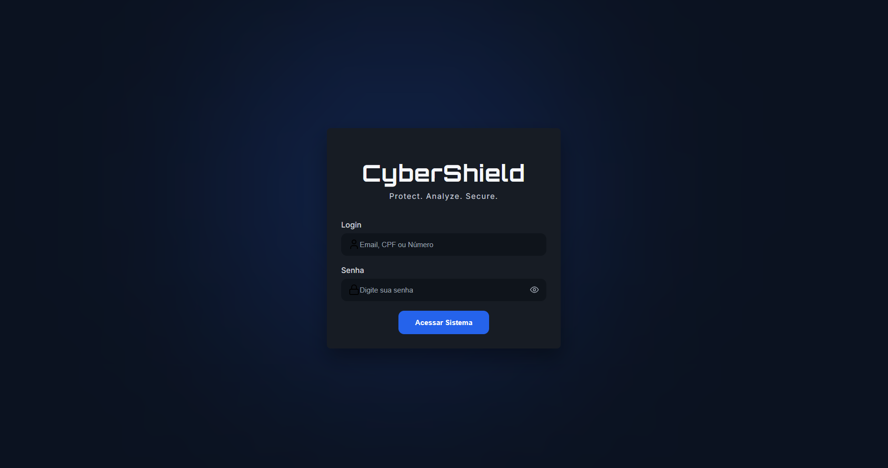
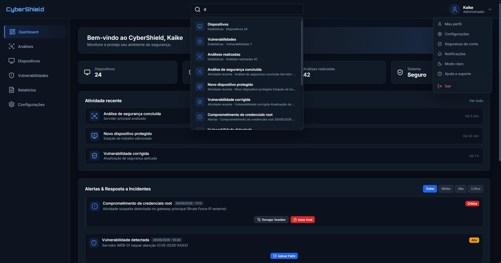
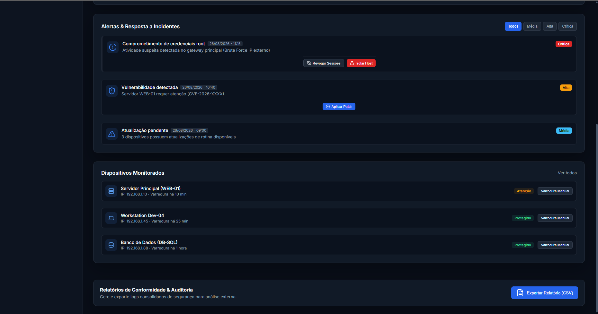

# 🛡️ CyberShield

> Plataforma de monitoramento e análise de segurança digital.

## 📌 Sobre o projeto

O **CyberShield** é um projeto de desenvolvimento voltado para monitoramento, análise e visualização de informações relacionadas à segurança digital.

O objetivo é desenvolver uma interface moderna, organizada e intuitiva que permita ao usuário acompanhar atividades, alertas, dispositivos e informações relacionadas à segurança através de um dashboard.

Este projeto está sendo **desenvolvido individualmente por mim**, desde a estruturação da aplicação até o desenvolvimento da interface e implementação das funcionalidades.

## 🚀 Funcionalidades

- 🔐 Sistema de login
- 📊 Dashboard de segurança
- 🚨 Sistema de alertas
- 🔎 Busca de informações
- 🌓 Tema claro e escuro
- 📄 Exportação de relatórios em CSV
- 🖥️ Monitoramento de dispositivos
- 🔔 Notificações e feedbacks da interface

## 🛠️ Tecnologias

- HTML5
- CSS3
- JavaScript
- Lucide Icons

## 📂 Estrutura do projeto

```text
CyberShield/
│
├── assets/
├── backend/
├── database/
├── docs/
│   └── screenshots/
│       ├── login.png
│       ├── dashboard-01.png
│       └── dashboard-02.png
│
├── frontend/
│
├── .gitignore
├── LICENSE
└── README.md
```

## 🖥️ Interface

### 🔐 Tela de Login

A tela de login foi desenvolvida com foco em uma interface limpa, moderna e alinhada à identidade visual do CyberShield.



### 📊 Dashboard

O dashboard apresenta uma visão geral do ambiente de segurança, incluindo estatísticas, atividades recentes, alertas e dispositivos monitorados.



### 🚨 Alertas, Dispositivos e Relatórios

A interface também apresenta uma área dedicada ao gerenciamento de alertas, dispositivos monitorados e exportação de relatórios.



## 📈 Status do projeto

🚧 **Em desenvolvimento**

O CyberShield está atualmente em desenvolvimento e, neste momento, o projeto está concentrado principalmente na construção da interface **front-end** e na implementação das funcionalidades de interação.

### 🌓 Tema claro

O modo claro já está implementado na interface, porém **ainda está em processo de correção e refinamento**.

Alguns elementos visuais podem apresentar inconsistências no tema claro enquanto os ajustes de CSS e comportamento estão sendo realizados.

O tema escuro permanece como a principal referência visual atual do projeto.

## 🎯 Objetivos futuros

- [ ] Finalizar os ajustes do tema claro
- [ ] Implementação do backend
- [ ] Integração com banco de dados
- [ ] Sistema real de autenticação
- [ ] Análise real de vulnerabilidades
- [ ] Monitoramento real de dispositivos
- [ ] Geração de relatórios mais completos
- [ ] Integração entre front-end e backend

## 👨‍💻 Desenvolvimento

O **CyberShield está sendo desenvolvido individualmente por mim**, como parte do meu processo de aprendizado e evolução na área de desenvolvimento de software.

O projeto está sendo construído gradualmente, buscando aplicar na prática conceitos de:

- Desenvolvimento web
- Estruturação de projetos
- HTML e CSS
- JavaScript
- Interface e experiência do usuário
- Organização de código
- Git e GitHub

## 📚 Objetivo do projeto

Além de ser um projeto de estudo, o CyberShield está sendo desenvolvido com o objetivo de fazer parte do meu **portfólio profissional**, demonstrando minha evolução e capacidade de transformar uma ideia em uma aplicação estruturada.

## 👤 Autor

**Ka.rc_ (kaike ramos)**

Projeto desenvolvido individualmente para estudo, prática de desenvolvimento web e construção de portfólio profissional.